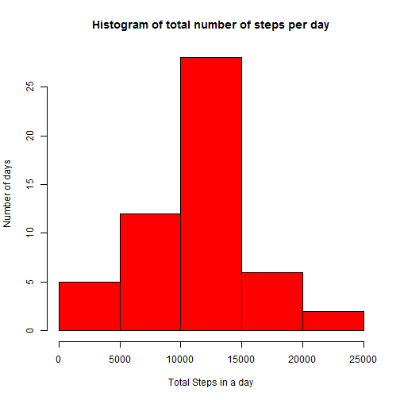

#REPRODUCIBLE RESEARCH PEER ASSESSMENT 1

**LOAD AND PREPROCESS THE DATA**

*1.Load the data*


```r
setwd('C:/Users/Elizabeth/Desktop/Datascience/Coursera/Reproducible_research/repdata_data_activity')
dir <- "C:/Users/Elizabeth/Desktop/Datascience/Coursera/Reproducible_research/repdata_data_activity/activity.csv"
data <- read.csv(dir)
head(data)
```

```
##   steps       date interval
## 1    NA 2012-10-01        0
## 2    NA 2012-10-01        5
## 3    NA 2012-10-01       10
## 4    NA 2012-10-01       15
## 5    NA 2012-10-01       20
## 6    NA 2012-10-01       25
```

*2. Process or transform data*

Let's first remove NAs


```r
data2 <- data[complete.cases(data),]
```

Let's convert the variable 'date' to numeric


```r
data2$date <- as.Date(data2$date, format="%Y-%m-%d")
head(data2)
```

```
##     steps       date interval
## 289     0 2012-10-02        0
## 290     0 2012-10-02        5
## 291     0 2012-10-02       10
## 292     0 2012-10-02       15
## 293     0 2012-10-02       20
## 294     0 2012-10-02       25
```


**WHAT IS MEAN TOTAL NUMBER OF STEPS TAKEN PER DAY**

*1.Make a histogram of the total number of steps taken each day*

Let's first calculate the total steps


```r
library(plyr)
total_steps_data <- ddply(data2, .(date), summarise, TotalSteps=sum(steps))
head(total_steps_data)
```

```
##         date TotalSteps
## 1 2012-10-02        126
## 2 2012-10-03      11352
## 3 2012-10-04      12116
## 4 2012-10-05      13294
## 5 2012-10-06      15420
## 6 2012-10-07      11015
```
Now plot the histogram


```r
hist(total_steps_data$TotalSteps, main= "Histogram of total number of steps per day",
      xlab="Total Steps in a day", ylab ="Number of days", col="red")
```

 

*2.Calculate Mean and median total number of steps taken per day*


```r
x <- mean(total_steps_data$TotalSteps)
x
```

```
## [1] 10766
```

```r
y <- median(total_steps_data$TotalSteps)
y
```

```
## [1] 10765
```


**WHAT IS THE AVERAGE DAILY ACTIVITY PATTERN?**

*1.Time series plot of the 5-minute interval and average number of steps taken*

Let's first create data for time series plot


```r
series_data <- ddply(data2, .(interval), summarise, AvgSteps=mean(steps))
```

Create the plot


```r
plot(series_data$interval, series_data$AvgSteps, type='l', xlab = '5-minute interval',
ylab = 'Average no. of steps across all days', main='Average number of steps averaged over all days')
```

 

*2. Get the interval with maximum average number of steps in an interval*

Maximum average number of steps


```r
maxsteps <- max(series_data$AvgSteps)
maxsteps
```

```
## [1] 206.2
```

Interval with maximum average number of steps


```r
max_Interval <- subset(series_data, AvgSteps == maxsteps)[1,1]
max_Interval
```

```
## [1] 835
```


**IMPUTING MISSING VALUES**

*1. Calculate and report total number of missing values in the dataset*


```r
dataNA <- sum(!complete.cases(data))
```

*2.Filling in all of the missing values in the dataset.*


```r
data3 <- ddply(data2, .(interval), summarise, MeanSteps = mean(steps))
```

**3.Create a new dataset that is equal to the original dataset but with the missing data filled in.**


```r
imputed_data <- data
na.row <- is.na(imputed_data$steps)
imputed_data[na.row,]$steps <- data3[match(imputed_data[na.row,]$interval, data3$interval), 2]
head(imputed_data)
```

```
##     steps       date interval
## 1 1.71698 2012-10-01        0
## 2 0.33962 2012-10-01        5
## 3 0.13208 2012-10-01       10
## 4 0.15094 2012-10-01       15
## 5 0.07547 2012-10-01       20
## 6 2.09434 2012-10-01       25
```

*4. A histogram of the total number of steps taken each day*

Calculate and report the mean and median total number of steps taken per day.
 

```r
data4 <- ddply(imputed_data, .(date), summarise, TotalSteps=sum(steps))
head(data4)
```

```
##         date TotalSteps
## 1 2012-10-01      10766
## 2 2012-10-02        126
## 3 2012-10-03      11352
## 4 2012-10-04      12116
## 5 2012-10-05      13294
## 6 2012-10-06      15420
```

```r
hist(data4$TotalSteps, col="red", ylab="No. of days", xlab="Total steps per day", 
main="Imputed Histogram of the total number of steps per day")
```

 

Mean and median total number of steps taken per day.


```r
mean_Total <- mean(data4$TotalSteps)
median_Total <- median(data4$TotalSteps)
```


**ARE THE DIFFERENCES IN ACTIVITY PATTERNS BETWEEN WEEKDAYS AND WEEKEND?**

**Create a new factor variable day_type**

Let's first convert date from string to numeric


```r
data$date <- as.Date(data$date, "%Y-%m-%d")
```

Create days of the week 


```r
data$day <- weekdays(data$date)
```
If it is a weekday then day_type = "weekday" 


```r
data$day_type <- c("weekday")
```

If it is a weekend, then day_type = "weekend"


```r
for (i in 1:nrow(data)){
  if (data$day[i] == "Saturday" || data$day[i] == "Sunday"){
    data$day_type[i] <- "weekend"
  }
}
```

Convert day_type as a factor variable


```r
data$day_type <- as.factor(data$day_type)
```

Calculate average number of steps in an interval across all days


```r
data5 <- aggregate(steps ~ interval+day_type, data, mean)
```

Create plot for weekdays and weekends


```r
library(ggplot2)
qplot(interval, steps, data=data5, geom=c("line"), xlab="Interval", 
      ylab="Average number of steps taken", main="Plot of 5-minute interval") + facet_wrap(~ day_type, ncol=1)
```

 


